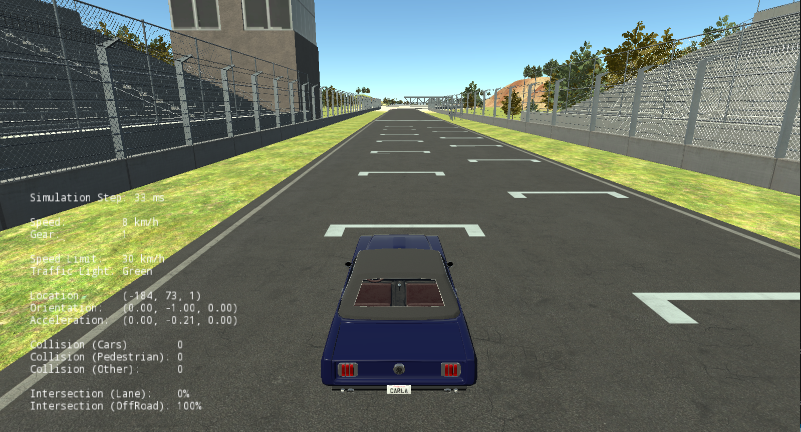

# lane-detection-OpenCV
 Lane detection in Carla Simulator using OpenCv

### About the Simulator ###
This simulation is carried out in Carla Simulator. Link to download the Simulator is given [here](https://d3c33hcgiwev3.cloudfront.net/3dXfty7_EemFOA6Hm29iNA_de05a1c02eff11e9821ed19f5bd73b7b_CarlaUE4Ubuntu.tar.gz?Expires=1606348800&Signature=Fd5eJmEkk0x9CWknmioKTAZoXKoKAbn0eyCY8-9ikxqlxzxp4Gev5t3lASeXPd17QM5Mpsl0laKEVPZ~MFprug3LvwiJdv0Gi43-GQMAUIujeAC5rTjD2w9zzZa5fUb37rFnGl0zngiD9yHK9dvgPjHcu2P1GBcXNNXlo0Zujng_&Key-Pair-Id=APKAJLTNE6QMUY6HBC5A).
The CARLA python client runs on **Python 3.5.x or Python 3.6.x (x is any number)**. Python 3.7 is not compatible with CARLA.

### Objective ### 
* Lane lines detection and tracking using OpenCV

### How to use ###
* Install carla Simulator in `$HOME/opt/` using the link above.
* Install the dependencies mentioned in the `$HOME/opt/CarlaSimulator/requirements.txt` file.
* Download the 'Course1FinalProject' Folder and place it in `$HOME/opt/CarlaSimulator/PythonClient`.
* In one terminal, start the CARLA simulator at a 30hz fixed time-step: `./CarlaUE4.sh /Game/Maps/RaceTrack -windowed -carla-server -benchmark -fps=30`
* In another terminal, change the directory to go into the "Course1FinalProject" folder, under the "PythonClient" folder. Run your controller, execute the following command while CARLA is open: `python3 module_7_og3.py`.

### Result illustration ###

![straight(images/Straight.png)
![Curve(images/Curve.png)
